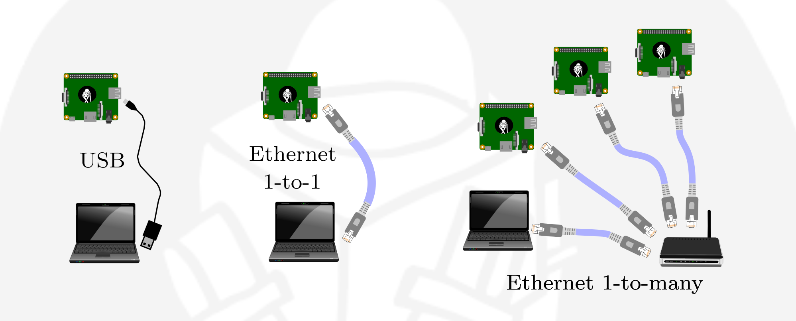

# Connecting to ROSbloX

ROSbloX can be connected to computers which run Windows, MacOS or Linux via USB-C or Ethernet. Note, ROSbloX are **plug-and-play** and do not require an installation of ROS on a computer.  




## Connecting to ROSbloX via USB

The USB port of a ROSbloX is configured to appear to a connecting computer as a network adapter. It runs a DHCP server on the USB interface and automatically assigns an IP address to the connecting computer. When connected via USB, the ROSBloX is accessible via a fixed static IP address, **10.99.11.1**. 

## Connecting to ROSbloX via Ethernet 

Each ROSbloX's Ethernet interface has two IP addresses linked to it, a static one which is set on the ROSbloX itself and a dynamic one which automatically is configured through DHCP.

### Dynamic IP Adress (from a DHCP Server)

The dynamic IP address of a ROSbloX is assigned to it by a DHCP server in the network. To access a ROSbloX via its dynamic IP address, the IP address has to retrieved from the DHCP server.

### Static IP Adress

Each ROSbloX is configured with a unique, static IP address in the **10.99.1.XXX/24** subnet. To access a ROSbloX via their static IP address, ensure the computer's connected Ethernet interface has a static IP address in the same subnet, e.g. 10.99.1.1/24. See [Changing a ROSbloX network configuration](#changing-a-rosblox-network-configuration), for instructions how to change a ROSbloX network configuration like its static IP address.

## Checking connectivity

Before receiving data from a ROSbloX, ensure that the ROSbloX is connected by pinging it:
```
ping rosblox.local # Resolves correct IP address automatically
```

Some networks prohibit discovery of ROSbloX by their mDNS name, i.e. it cannot be reached via ```rosblox.local```. In that case a ROSbloX can be reached via its IP address:
```
ping 10.99.11.1 # If connected via USB
ping 10.99.1.XXX # If connected via Ethernet (static IP address)
```

More information on how to use the ping command can be found [here](https://www.siteground.com/kb/how_to_perform_ping_checks_in_windows_linux_and_mac_os/).  If the ROSbloX is not reachable by either of the commands, the network setup does not work properly.
