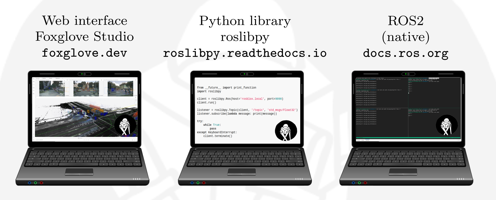

# Interfacing with ROSbloX


Three interfaces are available to transmit data to/from ROSbloX:  
- A Web interface which allows visualizing and saving data  
- A Python library which enables real-time data transmission and simple integration in Python scripts without installing ROS  
- The native ROS2 interfaces




## Web interface (Foxglove Studio) 

To open a ROSbloX's web interface, a computer requires the [Chrome](https://www.google.com/chrome/) browser to be installed. After a ROSbloX has started (which can take up to a minute), its web interface is accessible at <http://rosblox.local/> in your Chrome browser. The web interface is based on [Foxglove Studio](https://foxglove.dev/studio).


## Python library (roslibpy)

To transmit data to/from a ROSblox in real-time in Python, the [roslibpy: ROS Bridge library](https://roslibpy.readthedocs.io/) can be used. Install the library with 
```
pip install roslibpy
```
Afterwards, add the following lines in a Python script to receive data from a ROSbloX in real-time.

```
from __future__ import print_function
import roslibpy

client = roslibpy.Ros(host='rosblox.local', port=9090)
client.run()

listener = roslibpy.Topic(client, '/topic', 'std_msgs/Float32')
listener.subscribe(lambda message: print(message))

try:
    while True:
        pass
except KeyboardInterrupt:
    client.terminate()
```


## ROS2 (native)

Each ROSbloX is implemented as ROS2 node and can thus be reached via ROS2 native connections, e.g. it shows up when executing 
```
ros2 node list
ros2 topic list
```
We refer to the official [ROS documentation](https://docs.ros.org/) to get started with ROS. 
